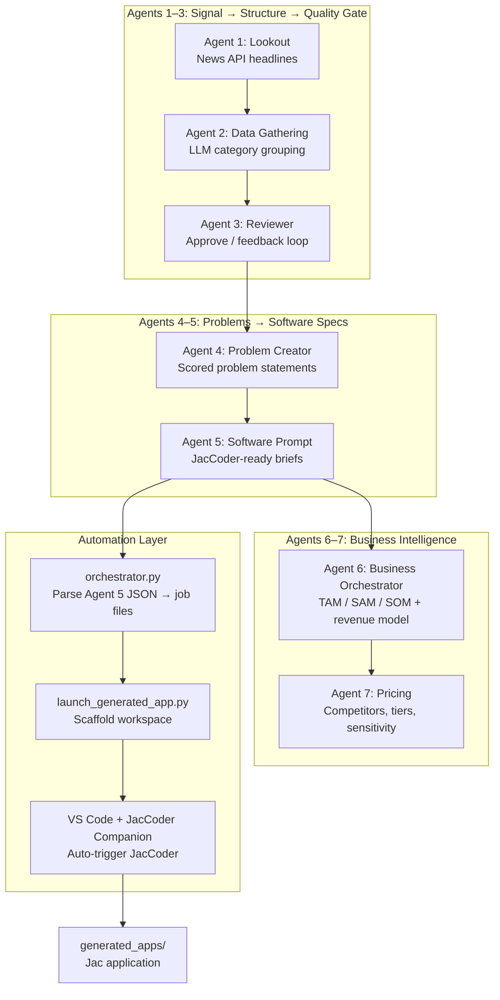

# OutLoop AI

**Build your startup on autopilot**

### What is OutLoop AI?

Every day, the news is full of real problems: budget cuts to science programs, new cybersecurity threats, shifts in how people work, breakthroughs that never reach the people who need them. Somewhere in those headlines are product ideas worth building. The hard part is finding them, validating them, and turning them into something a developer can actually ship.

**OutLoop AI** solves that. It is an autonomous pipeline of seven specialized AI agents that work together like a small product team — except they run in minutes, not weeks.

Here is the idea in plain terms:

1. **Start with the real world.** OutLoop AI reads live news headlines from technology, business, and science. No brainstorming in a vacuum — the input is what is trending *today*.

2. **Make sense of the noise.** Raw articles get grouped into clear themes (for example: "AI regulation," "space funding," "cybersecurity alerts"). One agent organizes; another agent reviews the groupings and sends feedback until the categories actually make sense.

3. **Turn trends into problems.** Each theme becomes a specific problem statement — something a piece of software could realistically solve — scored by urgency, scale, and feasibility.

4. **Design the product.** For every problem, the pipeline invents an app name, lists core features, picks a tech stack, and writes a complete build prompt. This is not a vague pitch deck bullet — it is a full spec ready for an AI coder.

5. **Think like a business.** Separate agents size the market (TAM, SAM, SOM), sketch a revenue model, research competitor pricing, and propose packaging tiers — so you know not just *what* to build, but whether it is worth building.

6. **Close the loop to code.** The best idea gets handed off automatically to **JacCoder** inside VS Code. A workspace is scaffolded, the prompt is pasted in, and development can begin — no manual copy-paste between "idea" and "implementation."

The name **OutLoop AI** comes from that last step: **closing the loop** from external signals → validated idea → business case → working software. Most tools stop at chat. OutLoop AI runs the full cycle.

Built for **JacHacks** at the **University of Michigan** and developed in the **Makerspace** community, OutLoop AI is written in [Jac](https://www.jaseci.org/) — the Jaseci programming language — where multi-agent orchestration (walkers, spawns, and LLM-native functions) is built into the language itself, not glued on afterward.

---

## Table of Contents

- [The Idea](#the-idea)
- [Why We Built This](#why-we-built-this)
- [How It Works](#how-it-works)
- [The Seven Agents](#the-seven-agents)
- [Jac & Multi-Orchestrational AI](#jac--multi-orchestrational-ai)
- [JacCoder Handoff & Code Generation](#jaccoder-handoff--code-generation)
- [Example Outputs](#example-outputs)
- [Project Structure](#project-structure)
- [Getting Started](#getting-started)
- [Running the Pipeline](#running-the-pipeline)
- [Configuration](#configuration)
- [Team](#team)
- [Technology Stack](#technology-stack)
- [Further Reading](#further-reading)

---

## The Idea

Most software starts with a guess: someone reads the news, has a hunch, sketches a feature list, and hopes the market agrees. OutLoop AI inverts that friction by **systematizing the path from signal to spec**:

1. **Sense** — Pull live headlines from technology, business, and science.
2. **Structure** — Group raw articles into meaningful thematic categories.
3. **Validate** — A reviewer agent critiques and iterates on those groupings until quality is high.
4. **Problemize** — Distill each category into a scored, actionable problem statement.
5. **Specify** — Generate a complete software brief (name, features, tech stack, JacCoder-ready prompt).
6. **Commercialize** — Run TAM/SAM/SOM market sizing and revenue model analysis.
7. **Price** — Produce competitor-aware pricing strategy with sensitivity math.
8. **Build** — Hand the winning idea to JacCoder inside VS Code and scaffold a Jac application workspace automatically.

The pipeline does not replace human judgment — it **compresses weeks of ideation into minutes** and produces artifacts (JSON, prompts, business profiles) that a founder or engineer can review, edit, or ship.

---

## Why We Built This

| Pain point | OutLoop AI response |
|------------|---------------------|
| Ideation is slow and biased toward what you already know | Agents pull from live News API headlines across multiple categories |
| LLM outputs are often vague or unstructured | Each agent has typed `obj` schemas and strict `sem` (semantic) prompts |
| One-shot prompting produces shallow analysis | Agent 3 runs a **review loop** (up to 3 iterations) before approving groupings |
| Great ideas die before a spec exists | Agent 5 emits self-contained prompts designed for AI code generation |
| Founders skip market sizing until it's too late | Agents 6–7 add venture-grade TAM/SAM/SOM and pricing strategy |
| Handoff from "idea" to "code" is manual copy-paste | Python orchestrator + VS Code companion extension automate JacCoder launch |

We chose **Jac** because agent orchestration is not an afterthought in Jaseci — walkers, spawns, and LLM-native `by llm` functions are part of the language. That lets each agent be a real module with imports, typed objects, and composable entry points rather than a pile of Python scripts calling OpenAI in sequence.

---

## How It Works



**Default end-to-end path** (via `./run_pipeline.sh`):

```
jac run agent5_software_prompt.jac   # implicitly runs Agents 1→5
        ↓
orchestrator.py extracts JSON after Agent 5 marker
        ↓
jobs/<slug>.json written (top-scored idea by default)
        ↓
launch_generated_app.py scaffolds generated_apps/job_<id>_<slug>/
        ↓
VS Code opens → JacCoder Companion detects .jaccoder-job.json
        ↓
JacCoder receives PROMPT.md contents automatically
```

Agents 6 and 7 are run independently when you need business and pricing depth:

```bash
jac run agent6_business_orchestrator.jac
jac run agent7_pricing.jac
```

Both support **cache files** (`agent5-result.json`, `agent6-result.json`) so you can iterate on downstream agents without re-running the full upstream pipeline.

---

## The Seven Agents

Each agent is a `.jac` file: a Jac module with typed objects, LLM-backed functions, and a `walker` entry point spawned from `with entry`.

### Agent 1 — Lookout (`agent1_lookout.jac`)

**Role:** Market sensing.

- Fetches top headlines from the [News API](https://newsapi.org/) across `technology`, `business`, and `science` categories.
- Returns up to 10 `Trend` objects (title + description).
- Pure data ingestion — no LLM calls. Fast and deterministic.

### Agent 2 — Data Gathering (`agent2_data_gathering.jac`)

**Role:** Thematic clustering.

- Consumes Agent 1's articles as `ArticleItem` objects.
- Uses `group_news_into_categories()` — an LLM function (`by llm`) with a `sem` prompt acting as a news editor.
- Produces 3–6 `NewsCategory` objects, each with a name, summary, and assigned articles.
- Also exposes `regroup_with_feedback()` for Agent 3's review loop.

### Agent 3 — Reviewer (`agent3_reviewer.jac`)

**Role:** Quality gate with iterative refinement.

- Reviews category groupings for meaningful names, correct placement, and accurate summaries.
- Returns a `ReviewDecision` (`approved`, `feedback`, `justification`).
- On rejection, sends feedback to Agent 2 for regrouping — up to **3 iterations** (`MAX_REVIEW_ITERATIONS`).
- `run_full_review()` is imported by Agent 4, so every downstream step works on **reviewer-approved** categories only.

This is a core example of **multi-agent orchestration with feedback**: not a linear chain, but a loop between Agent 2 and Agent 3 until quality criteria are met.

### Agent 4 — Problem Creator (`agent4_problem_creator.jac`)

**Role:** Problem discovery and prioritization.

- Takes approved categories and generates one `ProblemStatement` per category.
- Scores each problem 1–10 on **urgency**, **scale**, and **solvability** (software feasibility).
- Includes reasoning for each score — used later for ranking in the orchestrator.

### Agent 5 — Software Prompt Generator (`agent5_software_prompt.jac`)

**Role:** Product specification for AI coding.

- For each problem, produces a `SoftwarePrompt` with:
  - `software_name`, `description`, `core_features`, `tech_stack`
  - `prompt` — a **self-contained** natural-language spec for JacCoder
- Prints a machine-parseable marker line the Python orchestrator searches for:

  ```
  === Agent 5 Output: Software Prompts (Ready for Jac Coder) ===
  ```

- Chains through Agent 4 → Agent 3 → Agent 2 → Agent 1 internally when run standalone.

### Agent 6 — Business Orchestrator (`agent6_business_orchestrator.jac`)

**Role:** Venture-grade market and revenue analysis.

For each `SoftwarePrompt` from Agent 5 (or `agent5-result.json` cache):

- **Market analysis** — TAM (top-down + bottom-up), SAM, SOM, ICP segments, addressable account counts, avg ACV, growth rate.
- **Revenue model** — business model type, pricing strategy, revenue streams, year-1 MRR range.
- Combines into a `BusinessProfile` per software idea.

### Agent 7 — Pricing Strategy (`agent7_pricing.jac`)

**Role:** Go-to-market pricing depth.

For each `BusinessProfile` (or `agent6-result.json` cache):

- Competitor pricing research (3–5 comparables with tiers and sources).
- Pricing model recommendation with explicit rejection of alternatives.
- Value-based price point with economic value math.
- 2–3 packaging tiers, 5 firm discounting rules, and price sensitivity analysis (+20% / −20% scenarios).

---

## Jac & Multi-Orchestrational AI

### What is Jac?

**Jac** is the programming language at the heart of the [Jaseci](https://www.jaseci.org/) stack. It is designed for **AI-native, graph-oriented, multi-agent** software. Key concepts used throughout OutLoop AI:

| Jac concept | How OutLoop AI uses it |
|-------------|------------------------|
| `obj` | Typed data contracts between agents (`Trend`, `NewsCategory`, `SoftwarePrompt`, `BusinessProfile`, …) |
| `walker` | Agent entry points (`LookoutAgent`, `ReviewerAgent`, `BusinessOrchestrator`, …) |
| `spawn` | Orchestration primitive — `root() spawn LookoutAgent()` runs a walker and collects reports |
| `by llm` | Declares a function whose implementation is fulfilled by an LLM via **byLLM** |
| `sem` | Semantic instructions (system-level prompts) bound to LLM functions |
| `import from …` | Agents compose — Agent 5 imports `run_problem_creation` from Agent 4, which imports `run_full_review` from Agent 3, and so on |
| `with entry` | Module-level entry block run by `jac run <file>.jac` |

### Why Jac for multi-agent orchestration?

Traditional approaches often look like:

```
Python script → OpenAI API → parse JSON → another script → OpenAI API → …
```

OutLoop AI instead treats each agent as a **first-class Jac module**:

```jac
import from agent3_reviewer { run_full_review }
import from agent2_data_gathering { NewsCategory }

def run_problem_creation() -> list[ProblemStatement] {
    categories: list[NewsCategory] = run_full_review();  // Agents 1–3, with review loop
    ...
}
```

Benefits in practice:

1. **Composable pipelines** — Downstream agents call upstream `def` functions directly; the dependency graph is explicit in import statements.
2. **Typed handoffs** — `obj` schemas constrain what each LLM returns, reducing parse failures and ambiguous outputs.
3. **Walker/spawn model** — Agents are graph walkers; orchestration is native, not simulated with async task queues.
4. **Semantic prompts as code** — `sem` blocks live next to the functions they govern, making prompt engineering versionable alongside logic.
5. **Single runtime** — `jac run agent5_software_prompt.jac` executes the entire 1→5 chain in one process with streamed progress output.

### The review loop: orchestration beyond linear chains

Agent 3 is the clearest example of **multi-orchestrational** behavior (multiple agents coordinating with state and feedback):

```
Agent 2 groups articles
       ↓
Agent 3 reviews → approved? ──yes──→ continue to Agent 4
       │ no
       ↓
Agent 2 regroups with feedback
       ↓
Agent 3 reviews again (≤ 3 iterations)
```

This pattern — **generate → critique → refine** — is reusable anywhere you need LLM output quality gates without human-in-the-loop latency.

### byLLM integration

All LLM calls go through `byllm.lib.Model`:

```jac
import from byllm.lib { Model }
import from env_loader { OPENAI_API_KEY }

glob llm = Model(model_name="gpt-4o-mini", api_key=OPENAI_API_KEY);

def group_news_into_categories(articles: list[ArticleItem]) -> list[NewsCategory] by llm;
```

The `by llm` keyword tells Jac to route the function to the configured model, using the adjacent `sem` block as instructions and the function signature + argument types for structured output. Default model configuration lives in `jac.toml`:

```toml
[llm]
default_model = "openai/gpt-4o"
```

---

## JacCoder Handoff & Code Generation

Agent 5 produces prompts; **JacCoder** (a VS Code extension in the Jaseci ecosystem) turns them into Jac applications. OutLoop AI automates the handoff so nobody copies prompts by hand.

### Components

| Component | Location | Purpose |
|-----------|----------|---------|
| `orchestrator.py` | `automation/` | Runs Agent 5, parses JSON, writes `jobs/*.json`, invokes launcher |
| `launch_generated_app.py` | `automation/launcher/` | Scaffolds `generated_apps/job_<id>_<slug>/` |
| `run_job.sh` | `automation/launcher/` | Shell wrapper for manual job launches |
| JacCoder Companion | `automation/companion_extension/` | VS Code extension — detects job workspaces, triggers JacCoder |
| `focus_and_paste.applescript` | `automation/launcher/` | macOS fallback — Command Palette + paste `PROMPT.md` |

### What gets scaffolded per job

```
generated_apps/job_<id>_<slug>/
├── PROMPT.md              # Human-readable prompt for JacCoder
├── BUILD_SPEC.json        # App name, features, data model, tech stack
├── .jaccoder-job.json     # Full job metadata + launch provenance
├── main.jac               # Entry point stub (Jac application)
└── jac.toml               # Jac project config
```

The companion extension scans open workspaces for `.jaccoder-job.json`, logs metadata to **Output › JacCoder**, discovers the installed JacCoder extension by keyword matching, and attempts to open a new session with the prompt pre-filled. On macOS, if direct VS Code command invocation fails, AppleScript drives the Command Palette as a fallback.

See [`automation/README.md`](automation/README.md) and [`automation/companion_extension/README.md`](automation/companion_extension/README.md) for setup, permissions, and troubleshooting.

---

## Example Outputs

The `jobs/` and `generated_apps/` directories contain real pipeline artifacts:

| App | Score | Problem domain | Source job |
|-----|-------|----------------|------------|
| **SpaceAdvocate** | 9/10 | NASA budget cuts threatening research | `jobs/spaceadvocate.json` |
| **TrendSight** | — | AI-powered news categorization dashboard | `jobs/ai_trend_analyzer.json` |
| **CyberWatch** | — | Cybersecurity alert tracking | `jobs/sample_job.json` |

**SpaceAdvocate** (from Agent 5) illustrates the richness of a single prompt:

> *"Create a web application named SpaceAdvocate aimed at supporting advocacy for NASA funding. The platform should have community forums, fundraising tools, petition features, event organization, and a NASA resource library…"*

The orchestrator ranked it highest (score 9) on a problem about proposed NASA budget cuts — urgency, scale, and software solvability aligned.

---

## Project Structure

```
Outloop-AI/
├── agent1_lookout.jac              # News ingestion
├── agent2_data_gathering.jac       # LLM categorization
├── agent3_reviewer.jac             # Quality review loop
├── agent4_problem_creator.jac      # Scored problem statements
├── agent5_software_prompt.jac      # JacCoder-ready software specs
├── agent6_business_orchestrator.jac# TAM/SAM/SOM + revenue models
├── agent7_pricing.jac              # Pricing strategy
├── env_loader.jac                  # .env → OPENAI_API_KEY, NEWS_API_KEY
├── jac.toml                        # Jac project + npm/React deps for generated UIs
├── run_pipeline.sh                 # One-command pipeline entry point
│
├── automation/
│   ├── orchestrator.py             # Agents 1–5 → jobs → VS Code
│   ├── launcher/                   # Workspace scaffolder + AppleScript fallback
│   └── companion_extension/        # VS Code JacCoder Companion (TypeScript)
│
├── jobs/                           # Example job JSON files
├── generated_apps/                 # Scaffolded application workspaces
└── README.md
```

---

## Getting Started

### Prerequisites

| Requirement | Notes |
|-------------|-------|
| [Jac / Jaseci](https://www.jaseci.org/) | `jac` CLI available on PATH |
| Python 3.9+ | For orchestrator and launcher |
| Node.js 18+ | For companion extension build |
| VS Code 1.85+ | With `code` CLI in PATH |
| OpenAI API key | Used via byLLM (`gpt-4o-mini`) |
| News API key | [newsapi.org](https://newsapi.org/) — Agent 1 |

### Install Jac & dependencies

Follow the [Jaseci installation guide](https://docs.jaseci.org/) for your platform. From the project root:

```bash
# Create and activate a virtual environment (optional but recommended)
python3 -m venv jac-env
source jac-env/bin/activate

# Install Jac / Jaseci per official docs, then verify:
jac --version
```

### Environment variables

Create a `.env` file in the project root (loaded automatically by `env_loader.jac`):

```env
OPENAI_API_KEY=sk-...
NEWS_API_KEY=...
```

### Build the VS Code companion extension (one-time)

```bash
cd automation/companion_extension
npm install
npm run compile

# Sideload into VS Code
ln -s "$(pwd)" ~/.vscode/extensions/jaccoder-companion
```

Reload VS Code: **⌘⇧P** → `Developer: Reload Window`

On macOS, grant **Accessibility** and **Automation** permissions for the AppleScript fallback (see `automation/README.md`).

---

## Running the Pipeline

### Full pipeline (Agents 1–5 → JacCoder)

```bash
./run_pipeline.sh
```

| Flag | Effect |
|------|--------|
| `--all` | Launch a workspace for **every** software prompt, not just the top-scored |
| `--no-vscode` | Scaffold workspaces without opening VS Code |
| `--dry-run` | Run agents and write job files only; no launcher |

### Run individual agents

```bash
jac run agent1_lookout.jac
jac run agent2_data_gathering.jac
jac run agent3_reviewer.jac
jac run agent4_problem_creator.jac
jac run agent5_software_prompt.jac
jac run agent6_business_orchestrator.jac
jac run agent7_pricing.jac
```

### Run a specific job manually

```bash
./automation/launcher/run_job.sh jobs/spaceadvocate.json
```

### Caching between agents 5, 6, and 7

Save Agent 5 stdout JSON to `agent5-result.json` in the project root to skip re-running Agents 1–5 when iterating on business analysis:

```bash
jac run agent5_software_prompt.jac > /tmp/out.txt
# Extract the JSON array after the Agent 5 marker into agent5-result.json
jac run agent6_business_orchestrator.jac
```

Similarly, save Agent 6 output to `agent6-result.json` for Agent 7 pricing-only runs.

---

## Configuration

### `jac.toml`

Project metadata and dependencies for generated full-stack apps (React + Vite frontend tooling):

```toml
[project]
name = "JackHacksproject"
version = "0.1.0"

[llm]
default_model = "openai/gpt-4o"
```

### Review loop tuning

In `agent3_reviewer.jac`:

```jac
glob MAX_REVIEW_ITERATIONS: int = 3;
```

Increase for stricter quality gates (more API calls); decrease for faster runs.

### Orchestrator prompt selection

By default, `orchestrator.py` picks the **highest-scored** `SoftwarePrompt` from Agent 5. Use `--all` to scaffold every idea.

---

## Team

OutLoop AI was built for **JacHacks** at the **University of Michigan** by a team from the **Makerspace** community — four engineers who each owned a layer of the stack, from AI agents to frontend, backend, and databases.

| Contributor | Role |
|-------------|------|
| **Yamaan Nandolia** | Product Manager and Developer |
| **Ayush Bhardawaj** | Full Stack Engineer — AI Agents (Jac agent pipeline, byLLM integrations, multi-agent orchestration) |
| **Nathan Tihn** | Full Stack Engineer — Frontend & Databases (generated app UI, data models, persistence layer) |
| **Maria Guallapa** | Full Stack Engineer — Backend (API design, server-side logic, infrastructure for generated applications) |

The project started as our **JacHacks** submission and grew into **OutLoop AI** — each pipeline layer maps to a distinct agent in the code and a distinct specialty on the team.

---

## Technology Stack

| Layer | Technologies |
|-------|--------------|
| Agent runtime | **Jac** (Jaseci), walkers, spawn, byLLM |
| LLM | OpenAI **GPT-4o-mini** (agents), GPT-4o (default in `jac.toml`) |
| Data source | **News API** (headlines) |
| Orchestration bridge | **Python 3** (`orchestrator.py`, launcher) |
| IDE integration | **VS Code**, JacCoder extension, TypeScript companion extension |
| macOS automation | **AppleScript** (keystroke fallback) |
| Generated app UI | **React 18**, Vite, TypeScript (via `jac.toml` npm deps) |
| Config | `.env` files via `env_loader.jac` |

---

## Further Reading

- [Jaseci Documentation](https://docs.jaseci.org/)
- [Jac Language Overview](https://www.jaseci.org/)
- [`automation/README.md`](automation/README.md) — Launcher setup, job format, troubleshooting
- [`automation/companion_extension/README.md`](automation/companion_extension/README.md) — Extension architecture and discovery logic

---

## License

See repository license file. If none is present, contact the maintainers before commercial use.

---

<p align="center">
  <strong>OutLoop AI</strong> — Build your startup on autopilot.<br>
  Built with Jac, orchestrated by agents, handed off to JacCoder.
</p>
